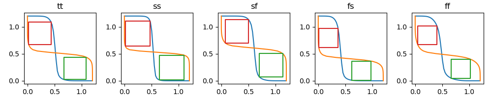
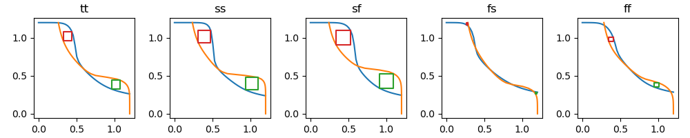
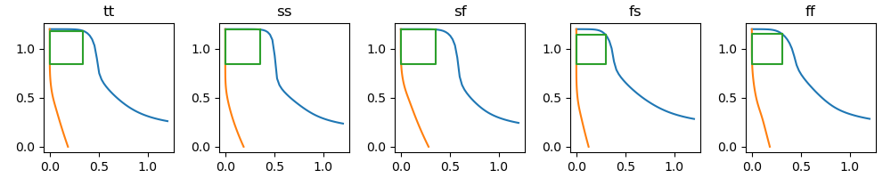
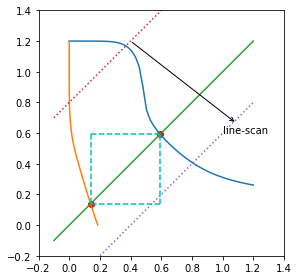

# SRAM-Butterfly

## Introduction

This project is a tool to help find the **read/hod/write margins** of SRAM bitcell and draw the corresponding butterfly diagrams.

## Examples

There are two examples, `app_01.ipynb` and `app_02.ipynb` .

And you can run the command `python main.py` .

The pictures below are the generated  butterfly diagrams of `hold`, `read` and `write`.

1. The hold-marin butterfly diagram

2. The read-marin butterfly diagram

3. The write-marin butterfly diagram

## Algorithm Principle

Taking the SRAM supply voltage of 1.2V as an example, two curves are generated by simulation.

By scanning the offset of the y-axis, a series of `y=x+offset_y` lines are generated, and then the two intersection points of the line and the two curves are calculated. These two intersection points generally correspond to the two diagonal coordinates of the square. The final margin value is obtained by comparing the size of this series of squares.

